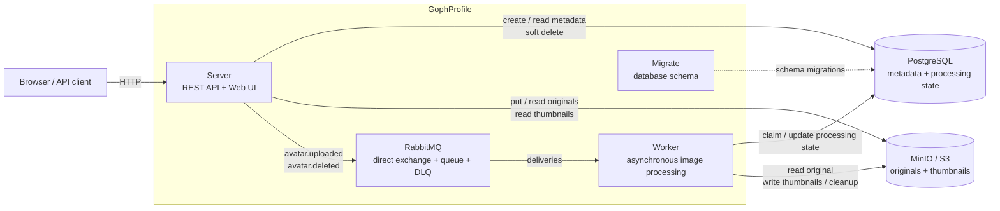
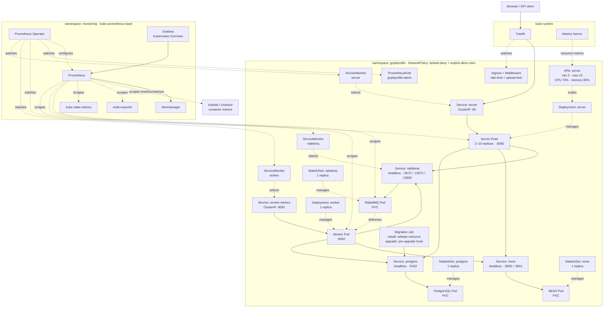
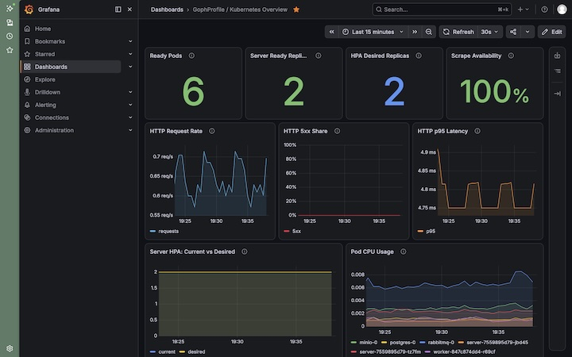

# 👤 [(^.^)] GophProfile

[](https://github.com/xhrobj/gophprofile/actions/workflows/go-ci.yaml)
[](https://sonarcloud.io/summary/new_code?id=xhrobj_gophprofile)
[](https://sonarcloud.io/summary/new_code?id=xhrobj_gophprofile)

GophProfile — сервис для загрузки, хранения, асинхронной обработки и выдачи пользовательских аватаров. Проект реализовывался в три этапа: сначала MVP с REST API и фоновой обработкой, затем наблюдаемость, а на завершающем этапе — развертывание в Kubernetes через Helm.

> 📋 [Общее техническое задание проекта](docs/SPECIFICATION.md)

## Спринт 11 — 🚀 MVP

> 📋 [Техническое задание спринта 11](docs/specs/11-mvp.md)

HTTP-контракт описан в [`api/openapi.yml`](api/openapi.yml)

В первом этапе реализован основной пользовательский сценарий: Server принимает изображения через REST API и Web UI, хранит метаданные в PostgreSQL и оригиналы в S3-совместимом MinIO, а Worker асинхронно создаёт миниатюры после получения событий из RabbitMQ.

### Архитектура



Server публикует `avatar.uploaded` после успешного сохранения изображения. Worker получает событие, создаёт JPEG-миниатюры `100x100` и `300x300`, сохраняет их в MinIO и обновляет состояние обработки в PostgreSQL.

Удаление также выполняется асинхронно: Server сразу скрывает запись через soft delete и публикует `avatar.deleted`, после чего Worker удаляет оригинал и миниатюры из объектного хранилища.

Frontend встроен в бинарник Server через `go:embed`, поэтому отдельный web-контейнер не требуется.

### Web UI

<a href="docs/images/mvp/gophprofile-web-ui.jpg">
  
</a>

Server отдаёт встроенный интерфейс по маршрутам:

- `/` — стартовая страница
- `/web/upload` — загрузка аватара
- `/web/gallery/{user_id}` — галерея пользователя

Web UI использует тот же REST API и тот же origin, поэтому отдельная CORS-конфигурация для локального сценария не нужна.

### REST API

Все URL ниже относятся к Server на `http://localhost:8080`.

| Метод | Endpoint | Назначение |
| --- | --- | --- |
| `POST` | `/api/v1/avatars` | загрузить аватар; обязательны `X-User-ID` и multipart-поле `file` |
| `GET` | `/api/v1/avatars/{avatar_id}` | получить оригинал или миниатюру через `?size=original \| 100x100 \| 300x300` |
| `GET` | `/api/v1/avatars/{avatar_id}/metadata` | получить метаданные и состояние обработки |
| `DELETE` | `/api/v1/avatars/{avatar_id}` | удалить аватар владельца; обязателен `X-User-ID` |
| `GET` | `/api/v1/users/{user_id}/avatar` | получить текущий аватар пользователя |
| `DELETE` | `/api/v1/users/{user_id}/avatar` | удалить текущий аватар пользователя; обязателен `X-User-ID` |
| `GET` | `/api/v1/users/{user_id}/avatars` | получить список аватаров пользователя |
| `GET` | `/health` | проверить PostgreSQL, MinIO и RabbitMQ |

Поддерживаются JPEG, PNG и WebP размером до 10 MiB. Миниатюры создаются асинхронно, поэтому сразу после `201 Created` их получение может временно возвращать `404`; готовность отражается в `processing_status` metadata.

Ошибки, сформированные Server, возвращаются в едином JSON-формате с `error`, безопасным `details` и `request_id`:

- `400 Bad Request` — некорректный запрос
- `403 Forbidden` — попытка удалить чужой аватар
- `404 Not Found` — ресурс не найден
- `405 Method Not Allowed` — метод не поддерживается маршрутом
- `413 Content Too Large` — превышен допустимый размер upload
- `500 Internal Server Error` — неожиданная внутренняя ошибка
- `503 Service Unavailable` — временно недоступны PostgreSQL, S3 или RabbitMQ

Технические детали внутренних и dependency errors остаются в структурированных логах и не передаются клиенту.

Пример загрузки:

```bash
curl -i \
  -H 'X-User-ID: Bob' \
  -F 'file=@avatar.png' \
  http://localhost:8080/api/v1/avatars
```

### Хранение и обработка

Канонические S3 keys:

```text
originals/{user_id}/{avatar_id}/{file_name}
thumbnails/{user_id}/{avatar_id}/100x100.jpg
thumbnails/{user_id}/{avatar_id}/300x300.jpg
```

RabbitMQ использует durable direct exchange и очередь с DLQ. Worker работает с manual ack, `prefetch=1`, bounded retry и идемпотентными переходами состояния; повторная доставка уже обработанного события не должна повторять побочные эффекты.

### Локальная разработка и тесты

Для запуска Go-процессов нужен Go 1.26. PostgreSQL, MinIO и RabbitMQ можно поднять через Docker Compose.

В первом терминале:

```bash
make run-server
```

Во втором терминале:

```bash
make run-worker
```

`make run-server` и `make run-worker` автоматически поднимают необходимую инфраструктуру и читают `.env`. Другой env-файл можно передать через `ENV_FILE`, например `make run-server ENV_FILE=.env.local`.

Основные проверки:

```bash
make test
make test-integration
make ci
```

`make ci` выполняет build, тесты с race detector, integration-тесты, `go vet` и `golangci-lint`.

### Ограничения MVP

- `X-User-ID` является идентификатором владельца для учебного MVP и не заменяет реальную аутентификацию или авторизацию.
- Между PostgreSQL и RabbitMQ не используется transactional outbox: сбои публикации событий обрабатываются recovery-логикой, поэтому атомарной гарантии между изменением данных и публикацией сообщения нет. Операции с S3 также компенсируются на уровне приложения.
- Миниатюры создаются в размерах `100x100` и `300x300` и всегда сохраняются как JPEG; динамическое преобразование формата не реализовано.

## Спринт 12 — 👀 Observability

> 📋 [Техническое задание спринта 12](docs/specs/12-observability.md)

Во втором этапе к приложению добавлен полный observability-стек:

- **Prometheus** и **Grafana** — сбор, хранение и визуализация метрик
- **Loki** и **Alloy** — централизованный сбор и просмотр логов
- **OpenTelemetry** и **Jaeger** — распределённая трассировка
- **Prometheus Alerting** и **Alertmanager** — правила алертинга и уведомления

GophProfile использует три взаимодополняющих сигнала:

- **metrics** отвечают на вопрос «что происходит с сервисом?» — Prometheus собирает числовые ряды, а Grafana показывает их на дашбордах
- **logs** помогают понять «что произошло в конкретный момент?» — JSON-логи Server и Worker собираются Alloy и хранятся в Loki
- **traces** показывают «где именно прошёл запрос и на каком участке возникла задержка или ошибка?» — Server и Worker отправляют OpenTelemetry traces по OTLP/HTTP напрямую в Jaeger

Для централизованного хранения логов выбран **Grafana Loki**: Alloy собирает JSON-логи контейнеров и отправляет их в Loki, а Grafana используется для поиска, корреляции и перехода из логов в трассировку.

### Metrics: RED и бизнес-сигналы

Для HTTP используется модель **RED**: Rate, Errors, Duration. Основные метрики:

- `gophprofile_http_requests_total` — количество HTTP-запросов
- `gophprofile_http_request_duration_seconds` — длительность HTTP-запросов
- `gophprofile_avatar_uploads_total` и `gophprofile_avatar_upload_duration_seconds` — результаты и длительность загрузок
- `gophprofile_worker_processed_events_total` и `gophprofile_worker_processing_duration_seconds` — обработка событий Worker
- `gophprofile_avatar_storage_usage_bytes` — суммарный размер оригиналов
- `gophprofile_postgres_pool_*` — состояние пула PostgreSQL
- RabbitMQ экспортирует метрики очередей через собственный Prometheus endpoint

В локальную Compose Grafana автоматически загружаются два прикладных дашборда: **GophProfile / Service Overview** — с HTTP RED и метриками процесса; **GophProfile / Business & Worker** — с метриками загрузок, Worker, хранилища, очередей RabbitMQ и пула PostgreSQL.

<a href="docs/images/observability/grafana-service-overview.png">
  
</a>

<a href="docs/images/observability/grafana-business-worker.png">
  
</a>

### Distributed tracing

Контекст трассировки переносится между Server и Worker в заголовках RabbitMQ-сообщения. Перед публикацией Server добавляет в сообщение W3C Trace Context, а Worker извлекает его перед началом обработки. Поэтому асинхронная обработка продолжается в той же трассе, хотя выполняется другим процессом.

В показанном сценарии один trace включает 6 spans Server и 8 spans Worker — всего 14:

<a href="docs/images/observability/jaeger-upload-search.png">
  
</a>

Внутри конкретной операции виден полный путь `POST /api/v1/avatars`: Server, PostgreSQL, MinIO, публикация события в RabbitMQ и продолжение обработки в Worker.

<a href="docs/images/observability/jaeger-upload-trace.png">
  
</a>

### Logs → trace correlation

`trace_id` и `span_id` записываются в JSON-логи как обычные поля, а не как Loki labels. Поэтому каждый новый trace не создаёт отдельный поток логов в Loki. При этом записи Server и Worker можно найти по общему `trace_id` и перейти из лога в Jaeger через derived field **View trace**.

<a href="docs/images/observability/loki-view-trace.png">
  
</a>

Grafana позволяет открыть Loki и Jaeger рядом: слева — связанные логи приложения, справа — соответствующая трасса.

<a href="docs/images/observability/loki-jaeger-correlation.png">
  
</a>

Типовой путь диагностики:

1. В Grafana заметить рост error rate или p95 latency
2. В Loki отфильтровать JSON-логи по `service`, уровню или `trace_id`
3. Из лога перейти в Jaeger по `trace_id` и посмотреть весь путь операции

### ⚡ Alerting

Prometheus отправляет сработавшие алерты в Alertmanager. В репозитории настроены правила `HighErrorRate` и `HighResponseTime`; отправка уведомлений во внешние системы намеренно не настроена.

`HighErrorRate` переходит в `FIRING`, если доля `5xx`-ответов Server за последние пять минут превышает 10% и это состояние сохраняется ещё пять минут:

<a href="docs/images/observability/prometheus-high-error-rate-firing.jpg">
  
</a>

После перехода правила в `FIRING` активный alert появляется в Alertmanager с `alertname="HighErrorRate"` и `severity="warning"`:

<a href="docs/images/observability/alertmanager-high-error-rate.jpg">
  
</a>

### Полный локальный запуск

Для полного локального запуска нужны Docker и Docker Compose.

Создайте локальный env-файл:

```bash
cp .env.example .env
```

Соберите и запустите весь стек:

```bash
make compose-up
```

После запуска доступны:

- Web UI и REST API: <http://localhost:8080>
- healthcheck: <http://localhost:8080/health>
- Server metrics: <http://localhost:8080/metrics>
- Worker metrics: <http://localhost:9092/metrics>
- Grafana: <http://localhost:3000>
- Prometheus: <http://localhost:9090>
- Alertmanager: <http://localhost:9093>
- Jaeger: <http://localhost:16686>
- MinIO Console: <http://localhost:9001>
- RabbitMQ Management: <http://localhost:15672>

Остановить контейнеры без удаления persistent volumes:

```bash
make compose-down
```

Удалить контейнеры вместе со всеми локальными данными полного Compose-стека:

```bash
make infra-erase
```

E2E-тест проверяет критический пользовательский поток только через публичный HTTP API: загрузку PNG, ожидание завершения Worker, получение оригинала и двух миниатюр, metadata, удаление и последующие `404`/пустой список.

```bash
make test-e2e
```

## Спринт 13 — ☸️ Kubernetes и Helm

> 📋 [Техническое задание спринта 13](docs/specs/13-k8s.md)

В третьем этапе GophProfile перенесён в Kubernetes и упакован в Helm Chart `deploy/helm/gophprofile`. Chart разворачивает Server, Worker, PostgreSQL, MinIO, RabbitMQ, migration Job, HPA, Traefik Ingress, NetworkPolicy, ServiceMonitor и PrometheusRule. `kube-prometheus-stack` остаётся инфраструктурой кластера и устанавливается отдельно.

### Архитектура Kubernetes



Публичный трафик проходит через Traefik в Service `server`. Ingress публикует только `/`, `/web` и `/api`; служебные `/live`, `/health` и `/metrics` через публичный Ingress не маршрутизируются. `default-deny` по умолчанию ограничивает ingress/egress, а отдельные NetworkPolicy разрешают Server и Worker обращаться к PostgreSQL, MinIO, RabbitMQ и DNS; migration Job — к PostgreSQL.

Для Server и Worker liveness использует `/live` и проверяет жизнеспособность процесса, а dependency-aware readiness через `/health` проверяет необходимые зависимости. При превышении Ingress rate limit Traefik возвращает `429 Too Many Requests` до передачи запроса Server.

Prometheus Operator отслеживает ServiceMonitor и PrometheusRule. Prometheus собирает метрики Server, Worker и RabbitMQ, а также Kubernetes-метрики из kube-state-metrics и kubelet/cAdvisor; **GophProfile / Kubernetes Overview** в Grafana использует этот Prometheus как источник данных. StatefulSet PostgreSQL, MinIO и RabbitMQ используют persistent volumes.

### Grafana: Kubernetes Overview

<a href="docs/images/k8s/grafana-k8s-overview.jpg">
  
</a>

### Что добавлено в Kubernetes-этапе

- Helm Chart с `values.yaml` и локальным профилем `values-local.yaml`
- Deployment для Server и Worker
- StatefulSet и persistent storage для PostgreSQL, MinIO и RabbitMQ
- migration Job: обычный ресурс release при install и `pre-upgrade` hook при upgrade
- readiness и liveness probes
- resource requests/limits
- HPA Server: от 2 до 10 replicas, CPU 70%, memory 80%
- Traefik Ingress с ограничением размера upload и rate limiting `20 rps`, burst `40`
- `default-deny` NetworkPolicy и явные разрешающие правила
- запуск application containers без root, с запретом privilege escalation и read-only root filesystem
- ServiceMonitor для Server, Worker и RabbitMQ
- PrometheusRule с `HighErrorRate`, `HighResponseTime` и `ServerUnavailable`
- отдельный `kube-prometheus-stack` для мониторинга Kubernetes-кластера

### Развёртывание в Rancher Desktop

Сначала подготовьте Secret-файлы из `.example` и заполните их локальными значениями:

```bash
cp deploy/k8s/app/secret.yml.example deploy/k8s/app/secret.yml
cp deploy/k8s/postgres/secret.yml.example deploy/k8s/postgres/secret.yml
cp deploy/k8s/minio/secret.yml.example deploy/k8s/minio/secret.yml
cp deploy/k8s/rabbitmq/secret.yml.example deploy/k8s/rabbitmq/secret.yml
```

Реальные Secret-файлы исключены из Git. Monitoring stack нужен до установки application Chart, потому что Chart создаёт `ServiceMonitor` и `PrometheusRule`. `make k8s-monitoring-up` также автоматически добавляет **GophProfile / Kubernetes Overview** в Grafana из kube-prometheus-stack:

```bash
make k8s-monitoring-up
make helm-check
make build-k8s-images
```

Namespace и внешние Secrets создаются отдельно от Helm release:

```bash
kubectl create namespace gophprofile --dry-run=client -o yaml | kubectl apply -f -

kubectl apply -n gophprofile \
  -f deploy/k8s/app/secret.yml \
  -f deploy/k8s/postgres/secret.yml \
  -f deploy/k8s/minio/secret.yml \
  -f deploy/k8s/rabbitmq/secret.yml
```

Локальные параметры образов и Rancher Desktop собраны в `values-local.yaml`. Release устанавливается или обновляется обычной командой Helm:

```bash
helm upgrade --install gophprofile deploy/helm/gophprofile \
  --namespace gophprofile \
  -f deploy/helm/gophprofile/values-local.yaml \
  --wait \
  --wait-for-jobs \
  --timeout 5m

kubectl rollout status deployment/server -n gophprofile --timeout=120s
kubectl rollout status deployment/worker -n gophprofile --timeout=120s
```

При первой установке migration Job является обычным ресурсом release: он создается одновременно с PostgreSQL, ждёт доступности БД и применяет миграции. Init containers Server и Worker пропускают workloads только после появления версии `schema_migrations`, соответствующей `migration.targetVersion`, с `dirty=false`, поэтому `helm upgrade --install --wait --wait-for-jobs` дожидается миграций и готовности workloads без взаимной блокировки. При upgrade миграции выполняются отдельным `pre-upgrade` hook `migrate-upgrade` до обновления workloads.

Если tracing включен, NetworkPolicy Server и Worker автоматически разрешает TCP egress на порт из `config.tracing.otlpEndpoint`. При необходимости назначение этого правила дополнительно ограничивается через `networkPolicy.tracingEgress.to` (`podSelector` / `namespaceSelector` для in-cluster collector или `ipBlock` для внешнего endpoint).

Статус release можно посмотреть командой `helm status gophprofile -n gophprofile`, удалить release — `helm uninstall gophprofile -n gophprofile`. Install Job управляется release как обычный ресурс; успешный `pre-upgrade` migration hook удаляется Helm автоматически, а failed hook остаётся для диагностики. Локальные Secrets и persistent PVC в lifecycle Helm release не входят и после uninstall сохраняются.

### Проверка

Проверить Chart до установки:

```bash
make helm-check
```

Команда выполняет `helm lint` и semantic render tests из `tests/helm`.

Проверить состояние workloads:

```bash
kubectl get pods -n gophprofile
kubectl get hpa -n gophprofile
kubectl get servicemonitor,prometheusrule -n gophprofile
```

После доступности Ingress можно выполнить тот же black-box E2E-сценарий уже против Kubernetes:

```bash
make test-k8s-e2e
```
