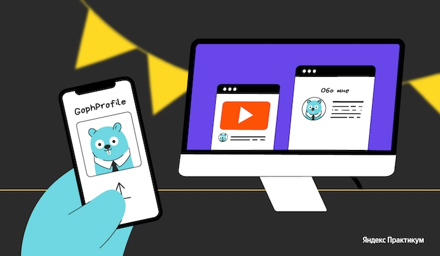

# Техническое задание на спринт

## О проекте

К концу обучения вы разработаете микросервис для управления аватарками пользователей — **GophProfile**.

Пользователь загружает свою фотографию в GophProfile один раз, а дальше любые сторонние платформы (блоги, форумы, сервисы комментариев и др.) могут запросить аватарку по его email. Если пользователь с таким email существует, сервис отдаёт его аватар. В противном случае возвращается стандартное изображение-заглушка.

В вашем портфолио появится сервис, который решает реальную продуктовую задачу: позволяет загружать, хранить, обрабатывать и раздавать контент через REST API. Вы построите его на востребованном стеке: Go, PostgreSQL, S3, RabbitMQ/Kafka, а затем упакуете в Docker и Kubernetes с полноценным Observability (Prometheus, Grafana, Loki/ELK/OpenSearch, Jaeger).

<a href="images/GophProfile.png">
  
</a>

Проект масштабный, поэтому мы разделили его на три спринта. В начале каждого спринта вы получите техническое задание с перечнем задач на текущий этап.

Хотите изучать теорию и работать над проектом одновременно? Или сначала пройти все уроки, а затем приступить к разработке? Выбирайте удобный для вас вариант.

Если сейчас приоритет — практика, можно пропустить часть теории и вернуться к ней позже. В последнюю неделю спринта рекомендуем полностью сфокусироваться на проекте.

Если у вас появятся вопросы, помните, что мы рядом, и вы всегда можете получить ответы в чате с одногруппниками.

## Задачи первого этапа разработки GophProfile

В этом спринте ваша цель — создать работающий MVP (Minimum Viable Product): сервис должен уметь принимать картинки, сохранять их и отдавать обратно.

### 1. Реализовать ядро сервиса и REST API

Создать HTTP-сервер на Go (Echo/Chi), подключить PostgreSQL для хранения метаданных и S3 (MinIO) для файлов. Реализовать эндпоинты загрузки, получения и удаления аватарок, а также интегрировать готовый фронтенд.

#### 1.1 Пример API сервиса

```text
# Загрузка аватарки
POST /api/v1/avatars
Content-Type: multipart/form-data
Headers: X-User-ID: string

# Получение аватарки
GET /api/v1/avatars/{avatar_id}
GET /api/v1/users/{user_id}/avatar

# Удаление аватарки
DELETE /api/v1/avatars/{avatar_id}
DELETE /api/v1/users/{user_id}/avatar
Headers: X-User-ID: string

# Получение метаданных аватарки
GET /api/v1/avatars/{avatar_id}/metadata

# Список аватарок пользователя
GET /api/v1/users/{user_id}/avatars

# Проверка работоспособности
GET /health

# Веб-интерфейс
GET /web/upload — форма загрузки
POST /web/upload — обработка загрузки
GET /web/gallery/{user_id} — галерея аватарок
```

#### 1.2 Архитектура и инфраструктура

Компоненты системы:

- HTTP-сервер с REST API и веб-интерфейсом;
- сервис обработки изображений;
- брокер сообщений (RabbitMQ или Kafka на выбор);
- база данных PostgreSQL для метаданных;
- S3-совместимое хранилище для файлов;
- Worker для асинхронной обработки.

Возможная структура проекта:

```text
avatars-service/
├── cmd/
│   ├── server/
│   └── worker/
├── internal/
│   ├── api/
│   ├── config/
│   ├── domain/
│   ├── handlers/
│   ├── repository/
│   ├── services/
│   └── worker/
├── pkg/
├── web/
├── migrations/
├── docker/
├── k8s/
└── tests/
```

#### 1.3 Технические требования

Основной стек:

- Go 1.21+;
- Echo/Chi для HTTP-роутинга;
- PostgreSQL для метаданных;
- MinIO/AWS S3 для хранения файлов;
- RabbitMQ или Kafka для очередей;
- Docker и Docker Compose.

Брокер сообщений (на выбор):

- RabbitMQ: используйте exchange типа `direct` или `topic`;
- Kafka: создайте топики для обработки изображений.

База данных:

- PostgreSQL: таблицы для метаданных, индексы, миграции.

#### 1.4 Функциональные требования

API эндпоинты:

1. `POST /api/v1/avatars` — загрузка аватарки.

   - Валидация формата (JPEG, PNG, WebP) — опционально.
   - Ограничение размера (до 10MB).
   - Создание миниатюр (100x100, 300x300).
   - Асинхронная обработка через брокер.

```json
POST /api/v1/avatars
Headers:
  X-User-ID: string (required)
  Content-Type: multipart/form-data
Body:
  file: binary (required, max 10MB)
Response 201:
{
  "id": "uuid",
  "user_id": "string",
  "url": "string",
  "status": "processing",
  "created_at": "2024-01-01T00:00:00Z"
}
Response 400:
{
  "error": "Invalid file format",
  "details": "Supported formats: jpeg, png, webp"
}
Response 413:
{
  "error": "File too large",
  "max_size": 10485760
}
```

1. `GET /api/v1/avatars/{id}` — получение аватарки.

   - Поддержка query-параметров (размер, формат) — опционально.
   - Кеширование заголовков — опционально.
   - Content-Type в зависимости от формата.

```text
GET /api/v1/avatars/{avatar_id}?size=300x300&format=webp
Parameters:
  size: string (optional, values: "100x100", "300x300", "original")
  format: string (optional, values: "jpeg", "png", "webp")
Response 200:
  Binary image data
  Headers:
    Content-Type: image/jpeg|png|webp
    Cache-Control: max-age=86400
    ETag: "hash"
Response 404:
{
  "error": "Avatar not found"
}
```

Получение метаданных:

```json
GET /api/v1/avatars/{avatar_id}/metadata
Response 200:
{
  "id": "uuid",
  "user_id": "string",
  "file_name": "avatar.jpg",
  "mime_type": "image/jpeg",
  "size": 1024000,
  "dimensions": {
    "width": 1920,
    "height": 1080
  },
  "thumbnails": [
    {"size": "100x100", "url": "..."},
    {"size": "300x300", "url": "..."}
  ],
  "created_at": "2024-01-01T00:00:00Z",
  "updated_at": "2024-01-01T00:00:00Z"
}
```

1. `DELETE /api/v1/avatars/{id}` — удаление аватарки.

   - Мягкое удаление в БД.
   - Асинхронное удаление из S3.

```json
DELETE /api/v1/avatars/{avatar_id}
Headers:
  X-User-ID: string (required)
Response 204: No Content
Response 403:
{
  "error": "Forbidden",
  "details": "You can only delete your own avatars"
}
```

1. `GET /health`.

   - healthcheck;
   - проверка БД, S3, брокера;
   - JSON ответ со статусами компонентов.

Веб-интерфейс:

- форма загрузки (с drag&drop — опционально);
- превью изображения;
- прогресс загрузки — опционально;
- галерея аватарок пользователя.

> ### Фронтенд уже готов
>
> Необязательно писать фронтенд с нуля. Вы можете взять готовое SPA-приложение [из репозитория](https://github.com/Yandex-Practicum/go-avatar-service-template) изменить его на свой вкус.

#### 1.5 Модель данных

PostgreSQL схема — пример:

```sql
CREATE TABLE avatars (
    id UUID PRIMARY KEY DEFAULT gen_random_uuid(),
    user_id VARCHAR(255) NOT NULL,
    file_name VARCHAR(255) NOT NULL,
    mime_type VARCHAR(100) NOT NULL,
    size_bytes BIGINT NOT NULL,
    s3_key VARCHAR(500) NOT NULL,
    thumbnail_s3_keys JSONB,
    upload_status VARCHAR(50) DEFAULT 'uploading',
    processing_status VARCHAR(50) DEFAULT 'pending',
    created_at TIMESTAMP WITH TIME ZONE DEFAULT NOW(),
    updated_at TIMESTAMP WITH TIME ZONE DEFAULT NOW(),
    deleted_at TIMESTAMP WITH TIME ZONE
);

CREATE INDEX idx_avatars_user_id ON avatars(user_id) WHERE deleted_at IS NULL;
CREATE INDEX idx_avatars_status ON avatars(upload_status, processing_status);
```

### 2. Настроить асинхронную обработку изображений

Внедрить брокер сообщений (RabbitMQ или Kafka на ваш выбор) и реализовать Worker-сервис для фонового создания миниатюр и удаления файлов с учётом идемпотентности.

#### 2.1 События для брокера

```go
type AvatarUploadEvent struct {
    AvatarID    string `json:"avatar_id"`
    UserID      string `json:"user_id"`
    S3Key       string `json:"s3_key"`
}

type AvatarProcessEvent struct {
    AvatarID    string         `json:"avatar_id"`
    Operations  []ProcessingOp `json:"operations"`
}

type AvatarDeleteEvent struct {
    AvatarID    string   `json:"avatar_id"`
    S3Keys      []string `json:"s3_keys"`
}
```

#### 2.2 Идемпотентность

- Используйте уникальные идентификаторы сообщений.
- Проверяйте статус обработки перед выполнением операций.
- Реализуйте retry с экспоненциальным backoff.

#### 2.3 Примеры

```go
// Пример отправки события после загрузки
func (s *AvatarService) PublishUploadEvent(avatarID, userID, s3Key string) error {
    event := AvatarUploadEvent{
        AvatarID: avatarID,
        UserID:   userID,
        S3Key:    s3Key,
    }

    // Для RabbitMQ
    return s.publisher.Publish(
        "avatars.exchange",      // exchange
        "avatar.uploaded",       // routing key
        event,
    )

    // Для Kafka
    return s.producer.Send(&sarama.ProducerMessage{
        Topic: "avatar-events",
        Key:   sarama.StringEncoder(avatarID),
        Value: sarama.JSONEncoder(event),
    })
}

// Пример обработки события в worker
func (w *Worker) HandleUploadEvent(event AvatarUploadEvent) error {
    // Получаем метаданные из БД
    avatar, err := w.repo.GetAvatar(event.AvatarID)
    if err != nil {
        return err
    }

    // Загружаем оригинал из S3
    image, err := w.s3.Download(event.S3Key)
    if err != nil {
        return err
    }

    // Создаем миниатюры
    thumbnails := []struct{
        size string
        data []byte
    }{
        {"100x100", w.resizer.Resize(image, 100, 100)},
        {"300x300", w.resizer.Resize(image, 300, 300)},
    }

    // Сохраняем миниатюры в S3
    for _, thumb := range thumbnails {
        key := fmt.Sprintf("thumbnails/%s/%s.jpg", event.AvatarID, thumb.size)
        if err := w.s3.Upload(key, thumb.data); err != nil {
            return err
        }
    }

    // Обновляем статус в БД
    return w.repo.UpdateProcessingStatus(event.AvatarID, "completed")
}
```

### 3. Обеспечить качество и контейнеризацию сервиса

Написать unit-тесты (**покрытие >50%**) и упаковать приложение в Docker-образы, настроив запуск окружения через Docker Compose.

#### 3.1 Тестирование

Unit-тесты:

- обработчики HTTP;
- сервисные слои;
- репозитории;
- утилиты для работы с изображениями.

Инструменты:

- `go test` для unit-тестов;
- `testify/suite` для интеграционных тестов;
- `testcontainers-go` для тест-окружения;
- `golangci-lint` для статического анализа.

#### 3.2 Докеризация

Dockerfile (multi-stage build):

```dockerfile
# Build stage
FROM golang:1.21-alpine AS builder
WORKDIR /app
COPY go.mod go.sum ./
RUN go mod download
COPY . .
RUN CGO_ENABLED=0 GOOS=linux go build -o server ./cmd/server
RUN CGO_ENABLED=0 GOOS=linux go build -o worker ./cmd/worker

# Runtime stage
FROM alpine:latest
RUN apk --no-cache add ca-certificates tzdata
WORKDIR /root/
COPY --from=builder /app/server .
COPY --from=builder /app/worker .
COPY --from=builder /app/web ./web/
```

Docker Compose для разработки:

- приложение (server + worker);
- PostgreSQL;
- RabbitMQ или Kafka;
- MinIO.

### 4. Бонусная задача: обеспечить безопасность

Если вы быстро справились с основными задачами, добавьте функции безопасности и покройте их тестами.

Безопасность:

- валидация MIME-типов и magic bytes;
- ограничение размера файлов;
- Rate limiting для API;
- CORS-настройки;
- валидация User-ID из заголовков.

Задача амбициозная, но результат того стоит. Вперёд!
